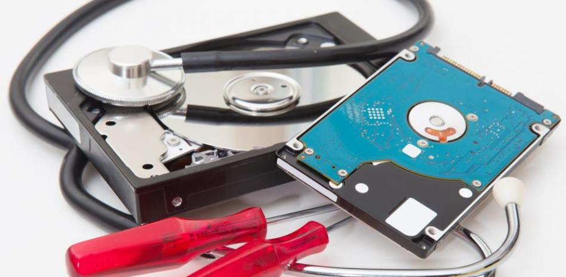

# Reparar disco duro dañado (HDD y SSD)

Un disco duro dañado puede ser una experiencia frustrante. Los datos que contiene pueden ser valiosos, y puede ser difícil saber qué hacer para repararlo. 

## Diferencias entre un HDD y un SSD en cuanto a la probabilidad de rotura y reparación

### HDD

Los HDD tienen partes móviles, como un disco giratorio y un cabezal de lectura/escritura. Estas partes móviles los hacen más susceptibles a daños físicos, como caídas, golpes o vibraciones. Si un HDD se daña físicamente, es probable que no se pueda reparar.

Los HDD también son más susceptibles a sufrir daños debido a errores lógicos, como sectores defectuosos o corrupción de datos. Estos daños pueden ser causados por fallos en el software, por errores en el hardware o por una alimentación eléctrica incorrecta.

### SSD

Los SSD no tienen partes móviles, por lo que son más resistentes a daños físicos. Si un SSD se cae o se golpea, es poco probable que se dañe físicamente.

Los SSD también son menos susceptibles a sufrir daños lógicos que los HDD. Esto se debe a que no tienen partes móviles que puedan verse afectadas por errores en el hardware o por una alimentación eléctrica incorrecta. En la mayoría de los casos, los daños lógicos en un SSD pueden repararse.

## Identifica el problema

Lo primero que debes hacer es identificar el problema con tu disco duro. ¿No arranca tu ordenador? ¿Se bloquea? ¿No puedes acceder a los datos? Una vez que hayas identificado el problema, podrás empezar a buscar una solución.

#### Herramientas de Análisis y Monitoreo

- [CrystalDiskMark](https://crystalmark.info/en/software/crystaldiskmark/): Esta herramienta gratuita puede realizar pruebas de rendimiento en discos duros y SSD.
- [HD Tune](https://www.hdtune.com/): Esta herramienta gratuita puede realizar una variedad de pruebas de rendimiento y diagnóstico en discos duros y SSD.
- [ATTO Disk Benchmark](https://www.atto.com/disk-benchmark/): Esta herramienta gratuita puede realizar pruebas de rendimiento en discos duros y SSD.

## Comprobación de errores

Una comprobación de errores es una buena manera de empezar a solucionar problemas con un disco duro. En Windows, puedes ejecutar una comprobación de errores desde el símbolo del sistema. Para ello, abre el símbolo del sistema como administrador y escribe el siguiente comando:

- habilitar TRIM puede mejorar el rendimiento de la SSD al permitirle liberar los bloques de datos que ya no se utilizan.
`fsutil behavior set disabledeletenotify 0`

- Verificar y reparar los archivos del sistema.
`sfc /scannow`

- Comprobar la integridad de la imagen de Windows.
`DISM /Online /Cleanup-Image /CheckHealth`

- Escanear la imagen de Windows.
`DISM /Online /Cleanup-Image /ScanHealth`

- Restaurar la imagen de Windows.
`DISM /Online /Cleanup-Image /RestoreHealth`

- Analiza y Desfragmentar disco duro (solo HDD)
`defrag c: /a`
`defrag c: /f`

- Analizar el disco y corregir los errores de archivos o los sectores defectuosos
`chkdsk C: /f`

- Habilitar la compresión de archivos en el disco duro principal (C:)
`compact /c /s:"C:\"`

- Habilitar la compresión de ficheros en el disco duro principal
`compact /CompactOs:always`

## Programa de reparación de discos duros

- [Victoria](https://www.filehorse.com/es/descargar-victoria-ssd-hdd/): Victoria es una herramienta de diagnóstico y reparación de discos duros que ofrece funcionalidades específicas para SSD y HDD. Permite realizar pruebas detalladas y reparaciones en ambos tipos de discos. 

- [HDD Regeneration](https://www.dposoft.net/): HDD Regeneration es una potente herramienta especializada en la recuperación y reparación de sectores defectuosos en discos duros. Ofrece capacidades avanzadas para restaurar áreas dañadas y mejorar el rendimiento general del disco.

- [EaseUS Data Recovery Wizard](https://es.easeus.com/data-recovery-software/): EaseUS Data Recovery Wizard es un software versátil de recuperación de datos. Aunque no es específicamente una herramienta de reparación de discos duros, puede ayudar en la recuperación de datos de discos dañados. Ofrece funciones de escaneo profundo para identificar y recuperar archivos perdidos.

Estos programas pueden ayudarte a recuperar datos de un disco duro dañado. Sin embargo, es importante tener en cuenta que, si el disco duro está gravemente dañado, es posible que no puedas recuperar todos los datos.

## Formatea el disco duro

Si todos los demás métodos han fallado, es posible que tengas que formatear el disco duro. Esto borrará todos los datos del disco duro, pero puede ser la única forma de solucionar el problema.

### Formateo profundo

El formateo profundo, también conocido como formateo de bajo nivel, es un proceso que borra todos los datos de un disco duro y reconfigura su estructura física. Esto puede ser útil para reparar un disco duro dañado, o para borrar datos confidenciales de manera segura.

#### Herramientas para formatear a bajo nivel un disco duro 

- [HDD Low Level Format Tool](https://hddguru.com/software/HDD-LLF-Low-Level-Format-Tool/): HDD Low Level Format Tool es una aplicación especializada para realizar formateos de bajo nivel en discos duros. Es útil para borrar completamente los datos y configurar la estructura física del disco.

- [Diskpart](https://learn.microsoft.com/es-es/windows-server/administration/windows-commands/diskpart): Diskpart es una herramienta de línea de comandos de Windows que proporciona funcionalidades para la administración de discos. Puede utilizarse para realizar diversas operaciones, como la creación de particiones y el formateo de discos.

#### Para formatear a bajo nivel un disco duro con Diskpart

1. `diskpart` - Inicia la herramienta Diskpart en la línea de comandos de Windows.

2. `list disk` - Muestra una lista de todos los discos disponibles en el sistema. Identifica el número del disco que deseas formatear.

3. `select disk 0` - Selecciona el disco específico para realizar operaciones sobre él. Sustituye "0" con el número de disco identificado en el paso anterior.

4. `clean all` - Limpia todos los datos en el disco seleccionado a nivel físico. Este comando realiza un formateo a bajo nivel. Ten en cuenta que este proceso eliminará todos los datos en el disco seleccionado de manera irrecuperable. Asegúrate de seleccionar el disco correcto antes de ejecutar este comando.

## Consejos para Evitar Daños en tu Disco Duro

- Evita que tu disco duro se caiga o se golpee.
- No expongas tu disco duro a altas temperaturas o humedad.
- Realiza copias de seguridad de tus datos con regularidad, no en el mismo disco duro.
- Realiza análisis seguidos, recomendación cada 6 meses si es un disco muy activo, si no cada 3 meses.
- No formatees seguido, ya que se pierde tamaño de uso al hacerlo.
- Realiza un formateo cada 6 meses si es un disco muy activo, si no cada 1 año.

## Diferencias entre un HDD y un SSD para el uso

- **Velocidad:** Los SSD son mucho más rápidos que los HDD en las operaciones de lectura y escritura, tanto secuencial como aleatoria. Esto se debe a que los SSD no tienen partes móviles, lo que les permite acceder a los datos de forma instantánea.

- **Ruido:** Los HDD son más ruidosos que los SSD, ya que tienen partes móviles que giran a alta velocidad.

- **Vibración:** Los HDD son más propensos a la vibración que los SSD, ya que las partes móviles pueden verse afectadas por las vibraciones externas.

- **Resistencia a los golpes:** Los SSD son más resistentes a los golpes que los HDD, ya que no tienen partes móviles.

- **Consumo de energía:** Los SSD consumen menos energía que los HDD, lo que puede ayudar a prolongar la vida útil de la batería de un portátil.

- **Precio:** Los SSD suelen ser más caros que los HDD, pero su precio ha ido bajando en los últimos años.

En términos de uso, los SSD son una mejor opción para aplicaciones que requieren un rendimiento rápido, como el arranque del sistema operativo, la apertura de aplicaciones y el procesamiento de datos. Los HDD son una mejor opción para aplicaciones que requieren mucho almacenamiento, como la edición de vídeo o la creación de archivos grandes.

# Licencia
Este proyecto está bajo la licencia [Creative Commons Attribution 4.0 International License](https://creativecommons.org/licenses/by/4.0/). Puedes compartir, adaptar y utilizar estos archivos siempre que des el crédito correspondiente al autor original.

# Nota importante
Se recomienda encarecidamente hacer una copia de seguridad de los datos importantes antes de continuar. El autor no se hace responsable de ningún daño o problema causado por el mal uso de estas tecnicas.
